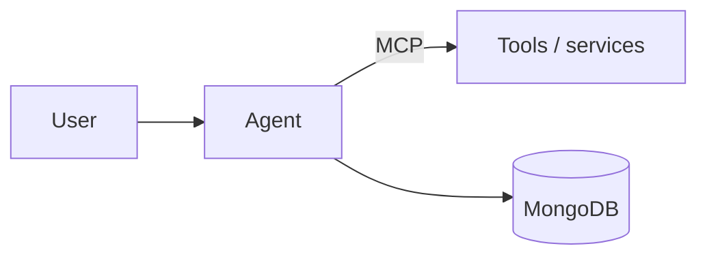

# Project name

> **Team:** `team-07-pi` · Agentic Commerce Hackathon 2026 · Applied AI Mongolia × Novelsoft
>
> ✏️ **Fill in every section below before 18:00 on 5 October.** Replace each `_…_` placeholder
> and delete the `<!-- hints -->`. Write in English or Mongolian. Repo access becomes
> read-only at 18:00; whatever is on `main` then is what the judges read.

<!-- One sentence: what your agent does, for whom. Example:
"An agent that plans a weekly grocery order within a family's budget and checks out in a sandbox store." -->
**One-liner:** _…_

## Links

| | |
|---|---|
| Slides | _URL_ |
| Demo video (2–3 min) | _URL_ |
| Live demo | _URL, or "run locally" (see Setup)_ |

## Team

| Name | Role | GitHub |
|---|---|---|
| _…_ | _e.g. agents / backend_ | @_…_ |
| _…_ | _…_ | @_…_ |
| _…_ | _…_ | @_…_ |

## 1. Problem

<!-- Who has this problem, how they solve it today, why that hurts. 3–5 sentences. -->
_…_

## 2. Solution

<!-- What the product does and the value it creates. Which use-case area:
E-commerce, Travel, Food & local, Subscriptions, Events, SME/B2B procurement,
Digital services, Marketplaces, Gaming/virtual goods, or your own. -->
**Area:** _…_

_…_

## 3. Agent workflow

<!-- Walk through one real run, step by step: the user's goal, the agent's plan,
each tool or agent it calls, where a human confirms, and the final transaction.
Map it to: Intent → Discover → Decide → Authorize → Transact → Verify. -->

1. **Intent:** _…_
2. **Discover:** _…_
3. **Decide:** _…_
4. **Authorize:** _…_
5. **Transact:** _…_
6. **Verify:** _…_

## 4. Architecture

<!-- A diagram is required. Mermaid renders on GitHub; an image in docs/ works too. -->



_Short description of each component._

## 5. MongoDB usage

<!-- What lives in MongoDB and why: agent memory, workflow state, catalog, orders,
vector search, audit log … Name the collections. -->

| Collection | What it stores | Why MongoDB |
|---|---|---|
| _…_ | _…_ | _…_ |

## 6. MCP / A2A / open interoperability

<!-- Which MCP servers or tools you expose or consume, and any A2A interaction between agents. -->
_…_

## 7. Safety and guardrails

<!-- How you handle: user authorization before consequential actions, budget/quantity
limits, human confirmation, transaction status and receipts, audit log, failure and
cancellation. Payments must be sandbox or simulated. -->
_…_

## 8. Tech stack

- **LLM / models:** _…_
- **Agent framework:** _…_
- **Backend:** _…_
- **Frontend:** _…_
- **Database:** MongoDB _(Atlas / self-hosted)_
- **Other:** _…_

## 9. Setup and run

<!-- Exact commands a judge can copy. List every environment variable;
never commit real keys, put them in .env.example with blank values. -->

```bash
git clone https://github.com/aai-mn/team-07-pi.git
cd team-07-pi
cp .env.example .env    # fill in the values below
# install
# run
```

| Variable | Purpose |
|---|---|
| _…_ | _…_ |

## 10. Disclosure

<!-- Required. List pre-existing code, templates, datasets, and major libraries or
services you did not build today. Write "None" if nothing. -->
_…_

## 11. Limitations and next steps

<!-- What doesn't work yet, what you would build next. Honesty scores better than surprises in Q&A. -->
_…_
